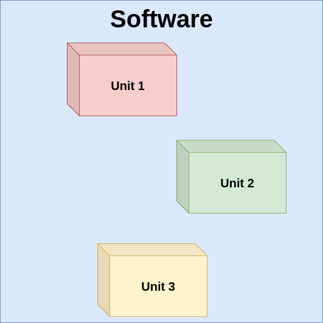
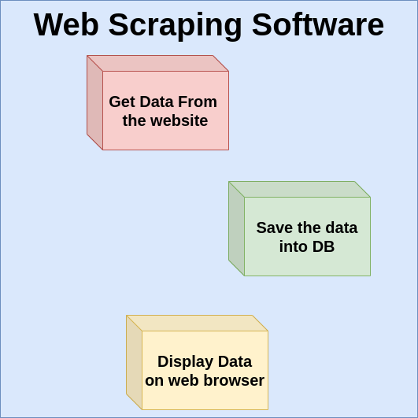

# Unit Tests
<hr/>

### What is a Unit Test?

Unit testing is a type of Software Testing where a software is divided into many 
independent units or chunks and tested one by one.
###

###

### Consider an example:

#### In the homework of the previous workshop you were supposed to do the following:
1. Write a Python program to Scrape the pages from Python Blogs.
2. Save the data into the DB.
3. Dockerize the project.

Now that we know Django, let us add an additional step of displaying the data on a Django app.

We can now divide the project into 3 parts as:
1. Get the data from the website.
2. Save the data into the database.
3. Display data on web browser.
###


####
Once you have completed the implementation of the entire software, 
you can test the software one part at a time.

1. First you can test whether your code to scrape the data is working fine.
2. Then you can see whether the data is saved properly without missing anything.
3. Finally you can see whether your data from the database is displayed properly or not.

#### 
### Advantages of Unit Testing:
1. The developer who tests gets to know whether each part of the software is working correctly or not.
2. The developer gets to fix bugs or implement something they missed out the first time.
3. The bugs are easier to catch since we are testing only a small part of code at once.

### Disadvantages of Unit Testing:
1. The process of unit testing takes more time since we have to test one part of the system at a time.
2. Unit Testing may miss out bugs which are produced when two chunks of code are working together.
3. You need to retest the code everytime you make changes.

### Implementing Unit Tests

#### Run the following command inside your docker container:
```
python3 -m unittest unittest_api.py
```
The above script implements two tests:
1. test_get_student_branch
2. test_get_all_students_for_branch

The test results are stored in the event_logs.txt file. You can view it by:
```
cat event_logs.txt
```

Essentially we are testing two of our ReST APIs.

We expect the status code of the response as 200, because the status code 200 for a ReST API means <b>SUCCESS</b>. You may be familiar with another popular status code:
####


###

The unittest_api.py is implemented using Python's unittest module.

The Python's `unittest`module is used for test automation which eliminate the disadvantages No. 1 and 3 mentioned above.
We have to inherit the `TestCase` class from the `unittest` module to implement unit tests using this module.

Read More: [Official Documentation](https://docs.python.org/3/library/unittest.html)

The `assertEqual` is used to identify whether the output we got is equal to what we expect.

e.g. In our code, we expect **SUCCESS** as response for our ReST APIs, hence we use:
```
self.assertEqual(result.status_code, 200)
```
Also, if our request does not give any response, then it means the test has failed.
```
self.assertNotEqual(result, None)
```
